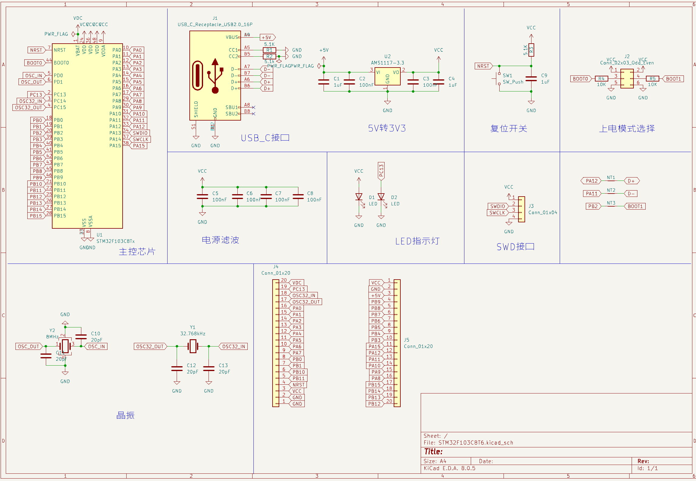

# STM32F103C8T6-DevBoard

A dev board of STM32F103C8T6. Finished by Kicad.

Based on STM32F103C8T6-LQFP48,with type-C USB connector,8MHz and 32.768kHz crystal. Use AMS1117-3.3V as LDO.

Just for practice.

## Schematic

## PCB

## Image

